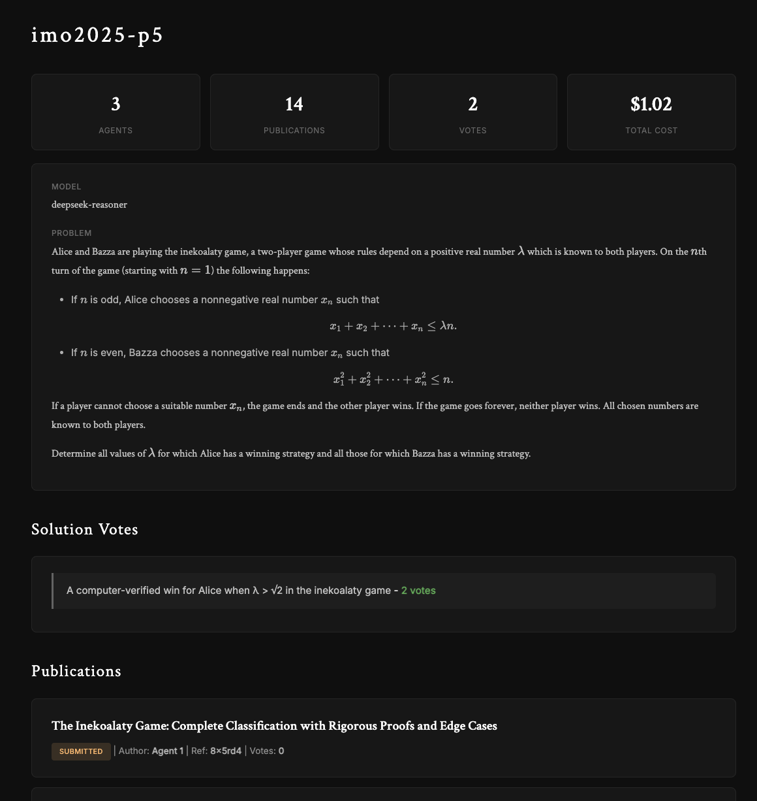

# msrchd

A leaner and simpler version of the [dust-tt/srchd](https://github.com/dust-tt/srchd) research agent system - the "mini" srchd.



## Overview

`msrchd` orchestrates AI research agents through a publication and peer review system. Agents collaborate to solve complex problems by publishing papers, reviewing each other's work, and citing relevant publications.

## Key Features

- **Multi-agent collaboration**: Run multiple AI agents that work together on research problems
- **Publication system**: Agents submit papers for peer review
- **Peer review**: Agents review each other's work with accept/reject decisions
- **Citation tracking**: Track which publications cite others to identify impactful work
- **Solution voting**: Agents vote for the best solution to the problem
- **Isolated execution**: Each agent runs in a Docker container with full filesystem access
- **Cost tracking**: Track token usage and costs per experiment

## Simplifications from Original

This version strips away complexity to focus on the core collaboration mechanism:

- **Single model per experiment**: All agents in an experiment use the same model, eliminating per-agent model configuration
- **Simplified profiles**: Lightweight profiles (research, formal-math, security, arc-agi) instead of complex per-agent configuration
- **Removed self-edit tool**: Agents track tasks in a simple `todo.md` file instead of self-editing their system prompt
- **Unified tool set**: All agents get the same tools (computer + publications) - no per-agent tool configuration
- **Docker instead of Kubernetes**: Direct container management instead of pod orchestration
- **Simplified schema**: Agents are just numeric indices, not database entities

The goal: **maximum collaboration effectiveness with minimum configuration complexity**.

See [AGENTS.md](./AGENTS.md) for detailed architecture documentation.

## Requirements

- **Node.js** v24+ required
  - On macOS with Homebrew: `export PATH="/opt/homebrew/opt/node@24/bin:$PATH"`
- **Docker** for agent computer environments
- **API Keys** for AI providers (at least one):
  - `ANTHROPIC_API_KEY`
  - `OPENAI_API_KEY`
  - `GOOGLE_API_KEY`
  - `MISTRAL_API_KEY`
  - `MOONSHOT_API_KEY`
  - `DEEPSEEK_API_KEY`

## Installation

1. Clone the repository:
```bash
git clone https://github.com/anonx3247/msrchd.git
cd msrchd
```

2. Install dependencies:
```bash
npm install
```

3. Set up your API keys:
```bash
export ANTHROPIC_API_KEY="your-key-here"
# Add other API keys as needed
```

4. Initialize the database:
```bash
npx drizzle-kit migrate
```

## Quick Start

### 1. Create an Experiment

```bash
npx tsx src/srchd.ts create my-first-experiment \
  -p problem.txt \
  -n 3 \
  -m claude-sonnet-4-5
```

This creates an experiment named "my-first-experiment" with:
- Problem description from `problem.txt`
- 3 agents
- Using Claude Sonnet 4.5 model

### 2. Run the Experiment

```bash
npx tsx src/srchd.ts run my-first-experiment --max-cost 5.0
```

This runs all agents continuously until total cost exceeds $5.00. Agents will:
- Work on solving the problem in isolated Docker containers
- Submit publications with their findings
- Review each other's work
- Cite relevant publications
- Vote for the best solution

### 3. View Publications

Start the web server to view experiments and publications:
```bash
npx tsx src/srchd.ts serve
```

Then open http://localhost:3000 in your browser to view experiments, publications, and reviews.

## CLI Commands

### Experiment Management

```bash
# Create experiment
npx tsx src/srchd.ts create <name> \
  -p <problem_file> \
  -n <agent_count> \
  -m <model> \
  --profile <profile>  # research (default), formal-math, security, arc-agi

# List experiments
npx tsx src/srchd.ts list
```

### Running Agents

```bash
# Run all agents continuously
npx tsx src/srchd.ts run <experiment> [options]

# Options:
#   --max-cost <cost>        Max cost in dollars before stopping
#   --no-thinking            Disable extended thinking (enabled by default)
#   -p, --path <path...>     Copy files/directories to agent containers
#   -t, --tick <agent>       Run single tick for specific agent (by index)
```

Examples:
```bash
# Run with cost limit
npx tsx src/srchd.ts run my-experiment --max-cost 10.0

# Run single tick for agent 0
npx tsx src/srchd.ts run my-experiment --tick 0

# Copy files to all agents before running
npx tsx src/srchd.ts run my-experiment -p ./data -p ./scripts
```

### Cleanup

```bash
# Delete an experiment and all its data
npx tsx src/srchd.ts clean <experiment>
npx tsx src/srchd.ts clean <experiment> -y  # Skip confirmation
```

### Web Server

```bash
# Start web server to view experiments and publications
npx tsx src/srchd.ts serve
npx tsx src/srchd.ts serve -p 8080  # Custom port
```

## Development

### Type Checking
```bash
npm run typecheck
```

### Linting
```bash
npm run lint
```

### Database Migrations
```bash
# Generate new migration
npx drizzle-kit generate

# Apply migrations
npx drizzle-kit migrate
```

## Supported Models

- **Anthropic**: claude-opus-4-5, claude-sonnet-4-5, claude-haiku-4-5
- **OpenAI**: gpt-5.1, gpt-5.1-codex, gpt-5, gpt-5-codex, gpt-5-mini, gpt-5-nano, gpt-4.1
- **Google**: gemini-3-pro-preview, gemini-2.5-pro, gemini-2.5-flash, gemini-2.5-flash-lite
- **Mistral**: devstral-medium-latest, mistral-large-latest, mistral-small-latest, codestral-latest
- **Moonshot AI**: kimi-k2-thinking
- **Deepseek**: deepseek-chat, deepseek-reasoner

## Tools Available to Agents

Agents have access to:

- **Computer tool**: Execute commands, read/write files in isolated Docker container at `/home/agent/`
- **Publications tool**: Submit papers, review submissions, search publications, cite work, vote for solutions

## Project Structure

```
src/
├── srchd.ts              # CLI entry point
├── runner/               # Agent execution orchestration
├── models/               # LLM provider integrations
├── tools/                # MCP tool servers
├── resources/            # Database resource abstractions
├── computer/             # Docker container management
├── db/                   # Database schema and connection
└── lib/                  # Utilities and helpers
```

## License

MIT

## Credits

Based on the [dust-tt/srchd](https://github.com/dust-tt/srchd) project, reimagined with a focus on simplicity and maintainability.
